# SpongeBob Colour Memory Game
---------
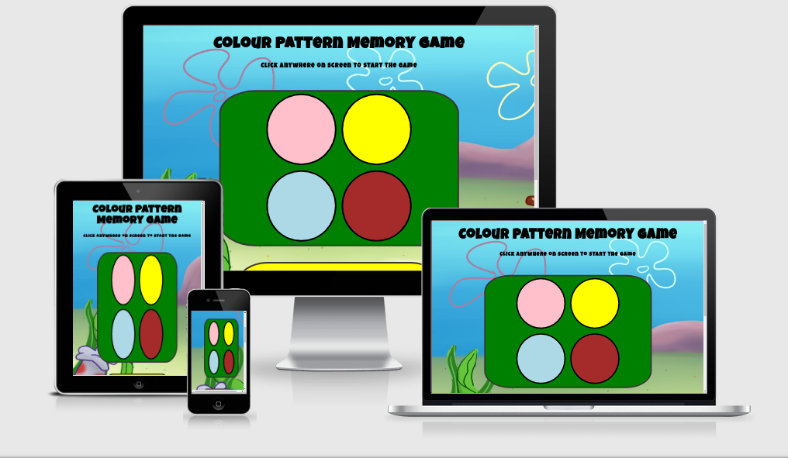

---------
## User Experience (UX)

## User Stories

* I would like to be able to understand how to play the game easily.
    This has been completed by:
    * placing an instructions box below the game allowing the user to understand exactly what to do by reading the text
* I want the game to be fun and enjoyable.
    This has been completed by:
    * The game being responsive to the user, when you click a button, you know you have clicked it as it breifly changes colour to grey. It has also been made enjoyable by having an increasing level system, which tells you how far you are, thus making it competitive.
* Game must be responsive to different device types.
    This has been completed by:This has been completed by:
    * Using responsive designs and layouts which change to the devices requirements

## Owner stories

* I want the user to enjoy the game.
    This has been completed by:
    * The game being responsive to the user, when you click a button, you know you have clicked it as it breifly changes colour to grey. It has also been made enjoyable by having an increasing level system, which tells you how far you are, thus making it competitive.

## Design

## Colour Scheme

* The colours used on the website represent the colours of each Spongebob character (the colours used are pink = patrick, yellow = Spongebob, blue = Squidword, brown = Mr crabs)
* the background box for the game is green due to it contrasting against the button colours very well, which will make it easier to see the game for everyone including those who are colour blind or visually impaired.

## Typeography

For the type face, i used a cartoonish style to match the overall idea of the game, which is a spongebob themed game, Due to copyright regulations, i am unable to usethe exact font, so, instead i have made do wiht a similar font that i feel gives off the same feel and look. the font is "Luckiest Guy" and was found on Google fonts. For more information on this, you can find the link in the credits section.

---------
## Wire Frames
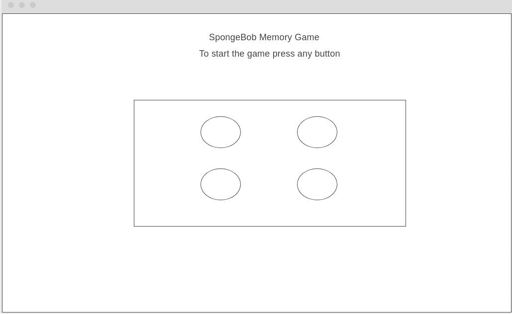

---------
## Features
* Responsive on all devices
* Custom interactive buttons that respond to user inputs
* Text that changes depending on the level the user is on
* Contrasting background, making it easy to see which colour is which
* Instructions below the game to help the user understand what they need to do to play

---------
## Technologies Used
* HTML
    * HTML is used to create the skeleton of the website and to lay down the fundementals that build this game.
* CSS
    * CSS is used to style the game and to provide individual style to specific elements.
* JavaScript
    * JavaScript is used to bring interactive functionality into the game,
* Jquery
    * Jquery is a simpler version of JavaScript which for this project is used to simplify and shorten the JavaScript code.
* Google Fonts
    * Google fonts was used to import one font, which formed the entirety of the website text, this fonts name is "Luckiest Guy".
* Balsamiq
    * Balsamiq has been used to design the wireframe
* GNU Image Manipulation
    * This is a Free to use image manipulation software that has been used to crop and edit the background image and images in the README file.
* Git
    * Git was used for version control by utilizing the Gitpod terminal to commit to Git and Push to GitHub.
* GitHub
    * GitHub is used to store the projects code after being pushed from Git.

---------
## Testing

### HTML validation
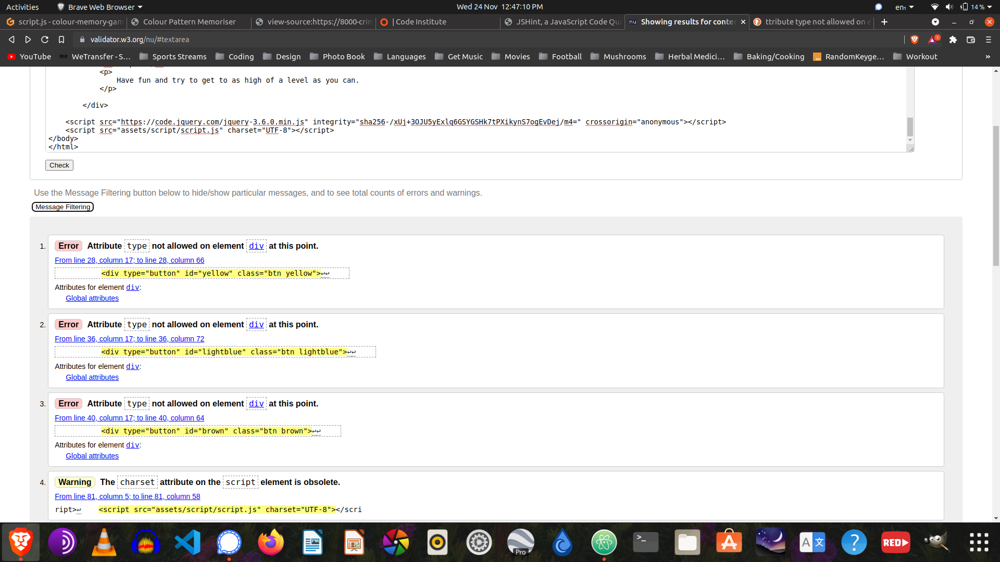

#### Errors found with the HTML

* Error found on line 28, attribute type not allowed on element div at this point
* Error found on line 36, attribute type not allowed on element div at this point
* Error found on line 40, attribute type not allowed on element div at this point

* all of these errors have been fixed by changing the type to a data type

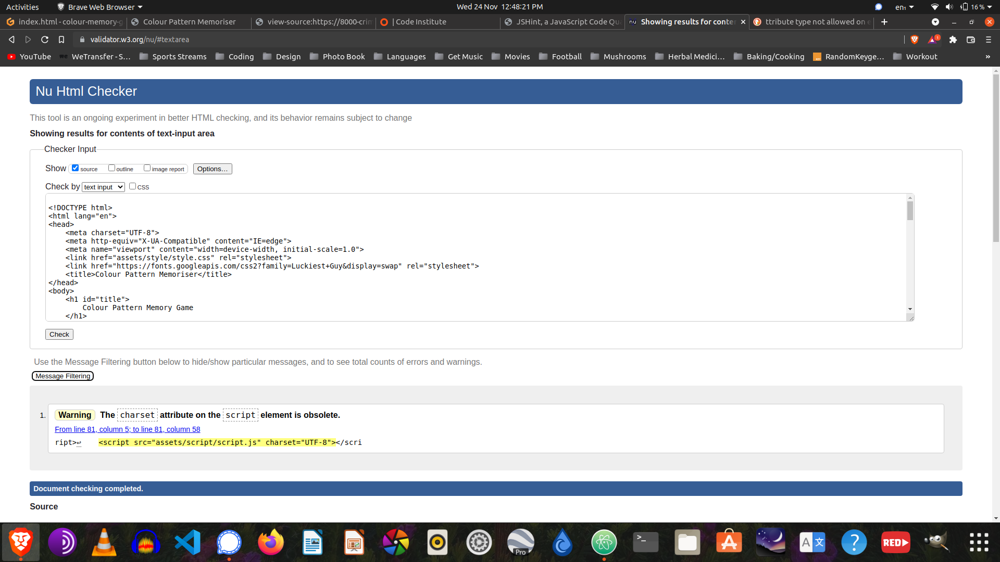

### CSS Validation
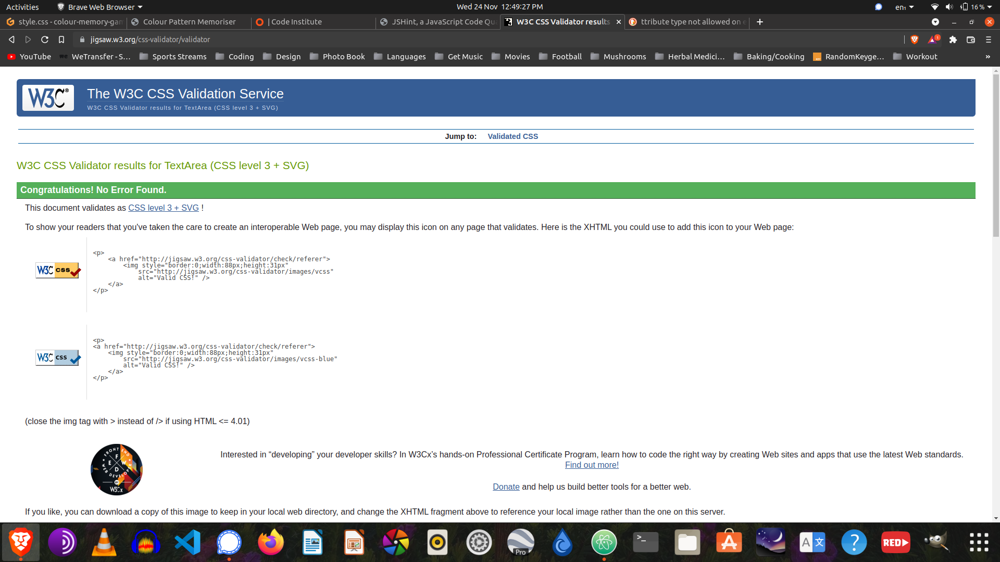

### JavaScript Validation
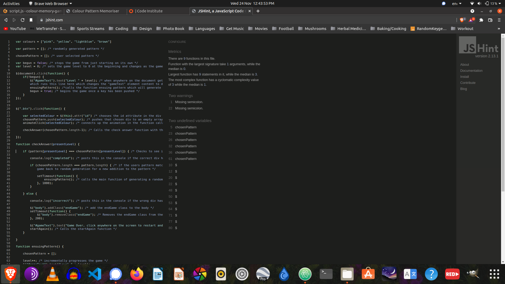

#### Errors found with the JavaScript

*   The error was i did not declare "chosenPattern" as a variable by putting "var" before the variable, as soon as i did this, the error messages went away.
*   The "$" errors are from the JQuery i have used, the validator i used doesnt identify JQuery.

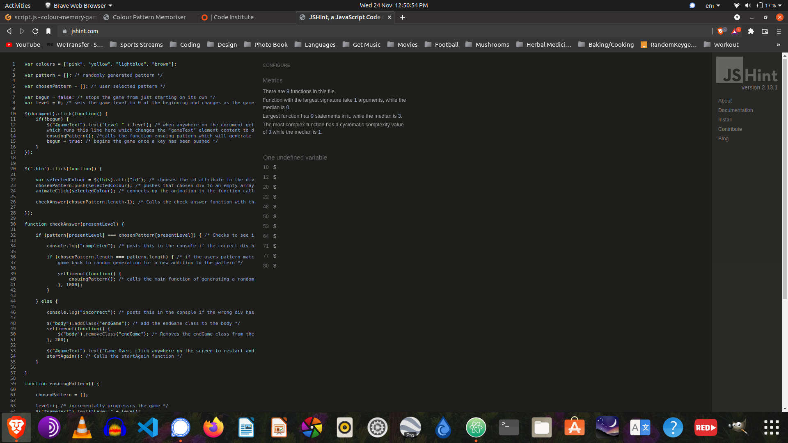

### Manual Testing

* The game has been tested on Google Chrome, Internet Explorer, Mozilla Firefox, Safari and Brave browsers.
* The website has been viewed on a variety of devices such as Desktop, Laptop, iPhone and Android phones.
* A large amount of testing was done to ensure that all pages were linking correctly.
* Friends and family members have been asked to review the site and documentation to point out any bugs and/or user experience issues.

### Manual Testing Screenshots

#### Checking if the CSS and the JavaScript is connected to the HTML document 

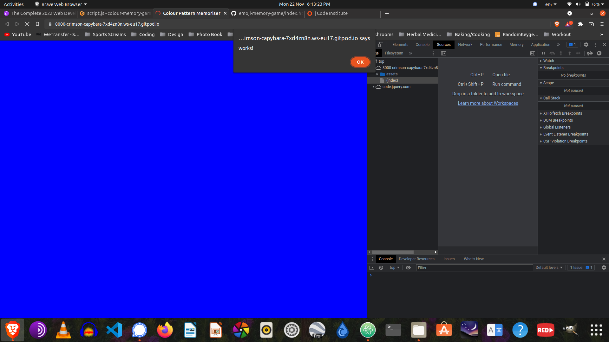

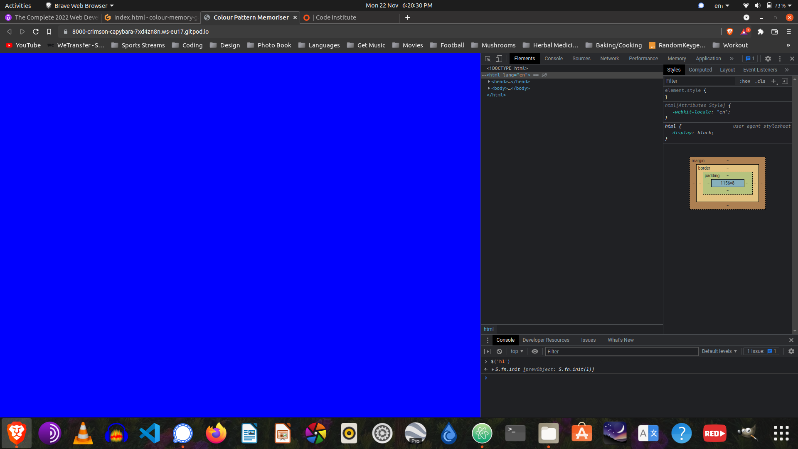

#### Checking to see if the random number/colour generation is functioning properly

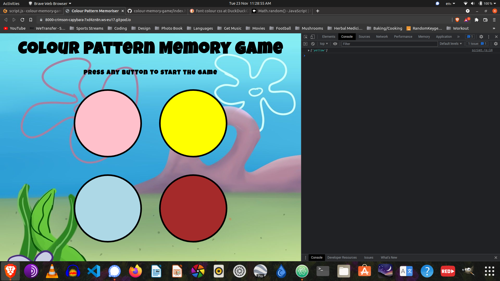

#### Cecking to see if the user inputs function correctly

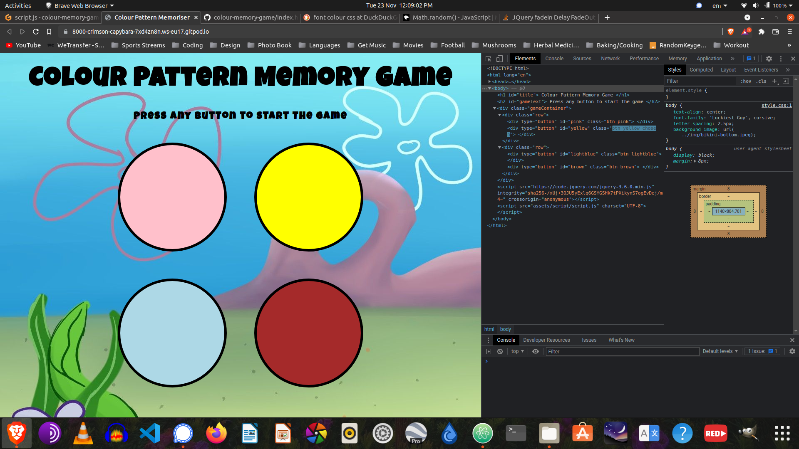

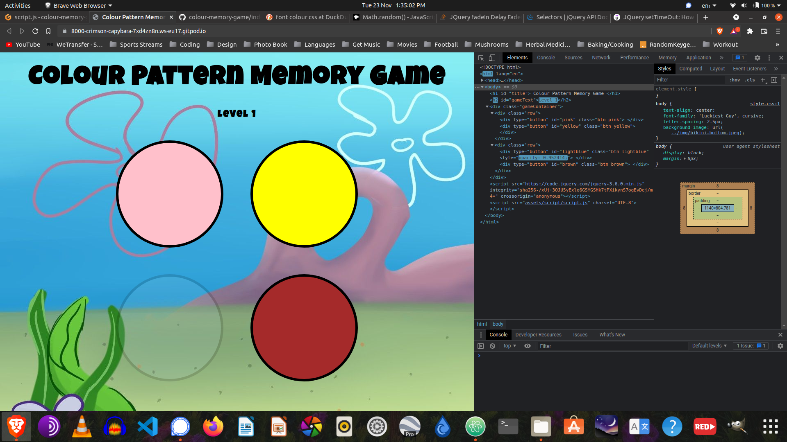

#### Checking if the code compares the user selected color against the randomly generated colour

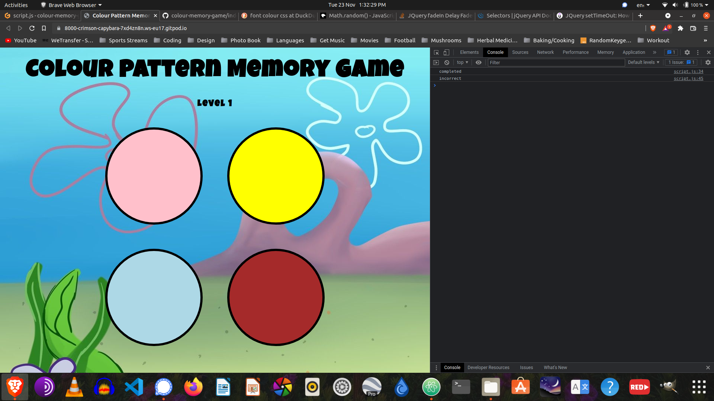

#### Checking the endGame code

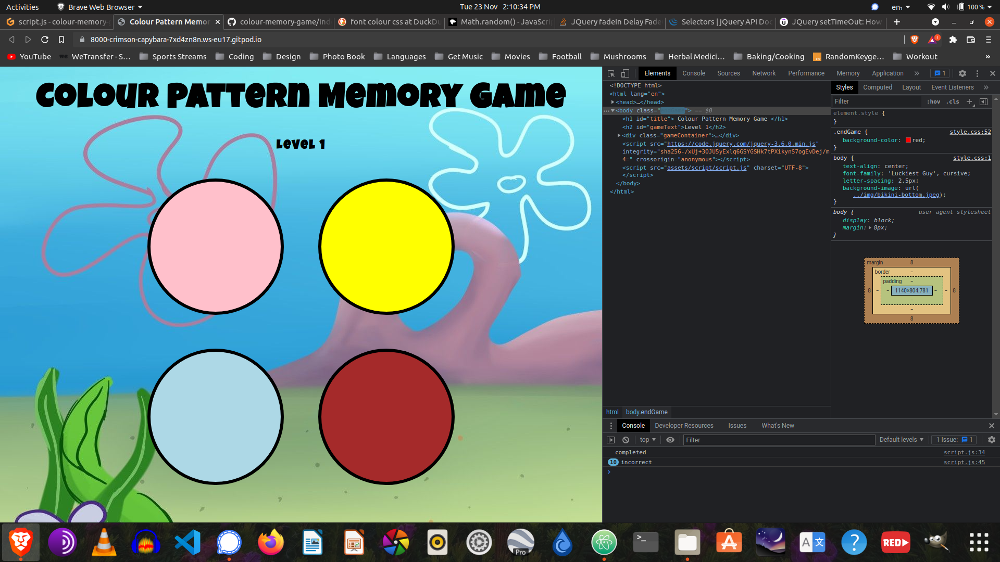

### Known Issues

* 

---------
## Deployment

### Deploying to GitHub Pages

1. Log in to GitHub and find the GitHub repository
2. At the top of the repository, click on the "Settings" button in the menu.
3. In the Settings page scroll down until you find the "Pages" area.
4. Click on the link in the "Pages" section, which will send you to the dedicated tab.
5. then, in the "Source" area, click the dropdown called "None" then select "Master Branch".
6. The page will automatically refresh.
7. Finally, scroll down the page to locate the newly published site in the "GitHub Pages" section.

## Forking the Repositiory

Forking the GitHub repository makes a copy of the original repository on your GitHUb account, which allows you to make changes to the document wihtout changing the original repository. If you wish to make a clone, follow these steps on how ot do it:

1. Log in to your GitHub account and find the repository.
2. At the top of the repository above the "Settings" button on the menu, find and click the "Fork" button.
3. After clicking the "Fork" button, You will now have a copy of the original repository in your GitHub account.

## Making a Local Clone of the Repository

1. Log in to GitHub and find the GitHub repository
2. Under the repository name, click "Clone or download".
3. To clone the repository using HTTPS, under "Clone with HTTPS", copy the link.
4. Open Git Bash
5. Change the current working directory to the location where you want the cloned directory to be made.
6. Type git clone, and paste the URL that you copied in Step 3.
    * Your code should look like this: `$ git clone https://github.com/YOUR-USERNAME/YOUR-REPOSITORY`
7. Press Enter and then your local clone will be created.
---------
## What To Improve Or Add

---------
## Issues when making the project
* Connecting the background image to the project - (FIXED) the code was fine, only problem was that i needed to clear my cache, once i did a hard reset by clicking reload in the dev-tools window i found that everything loaded.

* The level will not advance past level 1 - (FIXED) the id selector was missing the hashtag which stopped it from working

* No instructions and therefore not easy to understand what to do - (FIXED) Added instructions to the page

* Doesnt work on phone as it requires a keyboard button to be pushed which cant be done on a phone or tablet- (FIXED) changed the keypress function to a .click function which makes it friendly to mobile and tablet users as well as computer users.

* Colours appear in their own seperate columns which doesnt make it easy for the user to see or play the game - (FIXED) changed the height and width measurement units from rem to vh and vw to make the project more responsive to different devices.

* when you loose the game the game jumps to level 1 instead of showing the game over message - (FIXED) the level display text was in the wrong place, stopping the if else statement from displaying correctly, due to the level text overriding the else part.
---------
## Credits
* https://wallpapercave.com/spongebob-underwater-wallpapers - for the background image
* https://fonts.google.com/ - Used for finding and adding a custom font that goes by the name of "Luckiest Guy".
* https://stackoverflow.com/questions/14304473/jquery-fadein-delay-fadeout - for fading in and out divs.
* https://www.freecodecamp.org/news/learn-css-units-em-rem-vh-vw-with-code-examples/ - used for understanding what unit of measurement to use to be the most responsive.